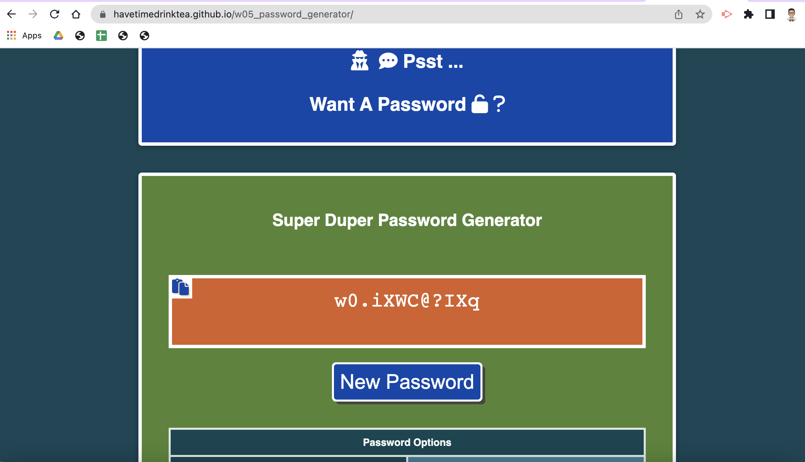

# w05_password_generator

## Description

This project is part of the Frontend Dev Bootcamp course challenge for the fifth week "JavaScript Intermediate". 

It requires us to use JavaScript to create a password generator that can create passwords of a specified length and include certain character sets. Thye script should dynamically pick characters from at least one of the character sets provided. It should also restrict the password to have a lenght of 10 to 64 character.

The JScript will produce the output to the HTML as part of the starter code provided. I've grouped repeated called codes into modular functions where possible.

In addition to that, I have created another Javascript that displays the password generating parameters (default or user input) to to the index.html. I have also styled the webpage and included a copy button to copy the generated password to the clipboard.

### Methodology: Pseudo Code
* Create a function to generate Confirm dialog boxes to ask user for inputs(password length and choice of character sets) when a button is pressed
* Store user inputs into variables.
  ** Conduct user input validation
    *** password lenght to be between 10 and 64 (inclusive).
    *** at least one of the 4 character sets (numeric, special, lower case and upper case letters) must be included.
  ** Use the default parameters where necessary.
* Create functions to:
  ** create a main array of character sets based on user/default inputs.
  ** randomly sort this main array using the Fisher-Yates method
  ** For each character in the password, generate a random integer that will pick up a character from this main array
  ** Contatenate each character to form the desired password.
* Return the generated password to the web page
* Display default/user password generating input parameters on the webpage:
  ** on page load: display default inputs 
  ** when the button to generate password is clicked: display user inputs and where they fail the validation tests then display the default input parameters.

### Further Improvements

* to use bootstrap modal component to display the default (not visually appealing) Confirm dialog boxes. This allows me to style the modal boxes.
* Check for user accessibility and load speed.

## User Story

AS A new frontend developer

I WANT to create a online password generator 

SO THAT users can use the generator to create unique passwords by specifying which character sets they wanted to be included and of a specific length everytime a generate button is clicked.

[Deployment link](https://havetimedrinktea.github.io/w05_password_generator/)

## Acceptance Criteria

The webpage must meet the following acceptance criteria:

* Generate a password when the button is clicked
  ** Present a series of prompts for password criteria
  ** Length of password (At least 10 characters but no more than 64.)
  ** Character types
    *** Lowercase
    *** Uppercase
    *** Numeric
  ** Code should validate for each input and at least one character type should be selected
  ** Once prompts are answered then the password should be generated and displayed in an alert or written to the page

## Table of Contents (Optional)

* [Installation](#installation)
* [Usage](#usage)
* [Credits](#credits)
* [License](#license)
* [Features](#features)

## Installation

N.A.

## Usage 

Screen dump of the submitted webpage:

## Credits

* Customize copy textarea content code from [Morhero](https://codepen.io/MORHERO/pen/JLPzyB)
* Randomly sort an array using the Fisher-Yates method [W3Schools - JavaScript Sorting Arrays](https://www.w3schools.com/js/js_array_sort.asp)

## License 

MIT License

## Features

### Main Features
* an online password generator on a styled webpage
* show the user a randomly generated password based on the default parameters on page load
* allow a user to generate a randomly generated password based on user's choice of password lenght and character set(s) by clicking a button.
* check user parameter inputs
  ** password length has to be an integer (otherwise the default number of 12 will be used)
  ** password lenght has to be between 10 and 64 (inclusive)
  ** at least one of the 4 character sets has to be chosen (otherwise all the 4 character sets will be taken as default)
* Prepare a main array of the character set(s).
* Randomly sort the array using the Fisher-Yates method
* Generate a random number to be used as the index to the sorted array to pick up a character
* Concatenate each character to form the password of desired length.
* Display the password to the webpage textarea.

### Extra Features
* Generate a password on page load based on default parameters
* Copy button in the textarea for user to copy the password to clipboard.
* Styled the webpage and included contact details.

